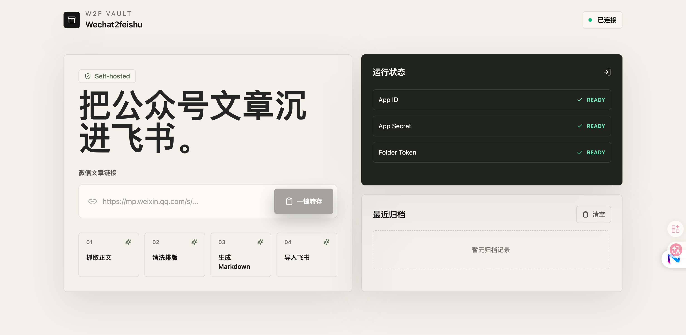

# W2F Vault

自托管的 Wechat2feishu 工具。粘贴微信公众号文章链接后，可以清洗正文、生成 Markdown 或 HTML、导入飞书文档，或直接下载到本地；也支持通过公众号 ID 批量获取该账号发布的文章并打包为 Markdown / HTML zip。

English documentation: [README.en.md](./README.en.md)

## Description

中文：自托管的微信公众号文章归档工具，支持单篇文章导出 Markdown / HTML、导入飞书文档、提取公众号 ID，并按公众号 ID 批量导出历史文章为 Markdown / HTML zip。

English: A self-hosted WeChat public account article archiver that exports articles to Markdown, imports them into Feishu Docs, extracts public account IDs, and batch-downloads account articles as Markdown zip files.

## 页面预览

当前本地运行界面如下：



## 功能

- 单篇公众号文章链接转 Markdown / HTML / PDF / DOCX / MHTML（HTML 为带阅读样式、可直接在浏览器打开的独立文档；PDF / DOCX / MHTML 均内嵌正文配图，无需联网即可查看）。
- 单篇公众号文章导入飞书文档。
- 从公众号文章链接提取公众号 ID（文章 URL 中的 `__biz`）。
- 使用公众号 ID 批量获取文章列表，并将文章内容导出为 Markdown / HTML / PDF / DOCX / MHTML zip，或导出为汇总 CSV 清单。
- 批量导出时把正文图片一并下载进 zip 的 `assets/` 目录，正文改用相对路径引用（音视频可选开启）。
- 增量导出：按公众号维度记录已归档文章，重复导出时自动跳过，避免重复消耗微信频控配额。
- 列表筛选：按标题关键词、发布日期区间、是否原创过滤，筛选发生在抓正文之前。
- 批量导出实时进度：导出过程通过 SSE 上报列表、逐篇抓取与打包阶段，前端显示进度条；ZIP 在服务端暂存后由第二次请求领取（取走即删）。
- 定时增量归档：按固定间隔自动导出指定公众号，ZIP 带时间戳落到 `data/archives/`，控制台可查看每个账号的上次运行结果并手动触发。
- 归档全文检索：导出时顺带建立索引，中文按二元切分、多词 AND 匹配，控制台可直接搜索历史归档并查看命中摘要。
- 断点续传：每抓完一篇立即落盘，导出中断后用相同参数重跑只补缺口，已抓部分不再消耗微信频控配额。
- 本地保存处理历史。

## 项目状态

这是面向个人知识流的自托管工具。微信和飞书的网页接口可能变化；如果抓取或导入失效，请提交 issue，并附上已脱敏的日志和复现步骤。

## 环境变量

复制 `.env.example` 为 `.env`，然后按需填写：

```bash
FEISHU_APP_ID=cli_xxx
FEISHU_APP_SECRET=xxx
FEISHU_FOLDER_TOKEN=xxx
FEISHU_APP_BASE_URL=https://open.feishu.cn
W2F_HISTORY_PATH=./data/history.json
W2F_CHROME_EXECUTABLE_PATH=
W2F_WECHAT_MP_TOKEN=
W2F_WECHAT_MP_COOKIE=

# 抓取限速，默认值已按"宁慢勿封"设定，一般不需要改
W2F_WECHAT_LIST_INTERVAL_MS=3000      # 文章列表分页之间的间隔
W2F_WECHAT_LIST_PAGE_SIZE=5           # 每页条数，1..20
W2F_WECHAT_ARTICLE_INTERVAL_MS=1200   # 逐篇抓取正文之间的间隔
W2F_WECHAT_MAX_RETRIES=3              # 触发频控后的重试次数
W2F_WECHAT_RETRY_BASE_MS=6000         # 退避基数，实际等待为基数 × 2^n

# 正文资源本地化（批量导出时把图片一并打进 ZIP 的 assets/ 目录）
W2F_ASSET_INTERVAL_MS=300             # 资源逐个下载之间的间隔
W2F_ASSET_MAX_BYTES=20971520          # 单个资源体积上限，默认 20MB，超限跳过
W2F_DOWNLOAD_MEDIA=false              # 是否连音频/视频一起下载，默认只下图片

# 跨次增量导出
W2F_ARCHIVE_INDEX_PATH=./data/archive-index.json  # 已归档文章索引，勾选"增量导出"时据此跳过
W2F_EXPORT_JOB_DIR=./data/export-jobs             # 流式导出时 ZIP 的服务端暂存目录
W2F_EXPORT_JOB_TTL_MS=1800000                     # 暂存包存活时长，过期由下次导出顺带清理

# 定时增量归档（本服务不内置 cron，由外部定时器周期性 POST /api/schedule 触发）
W2F_SCHEDULE_ENABLED=false                        # 总开关，关闭时 tick 只记录检查时间不执行
W2F_SCHEDULE_ACCOUNTS=                            # 要归档的公众号 ID，逗号 / 顿号 / 空格分隔
W2F_SCHEDULE_INTERVAL_MS=86400000                 # 同一账号两次归档的最小间隔，下限 5 分钟
W2F_SCHEDULE_FORMAT=markdown                      # 归档格式，取值同导出格式；非法值回退 markdown
W2F_SCHEDULE_LIMIT=0                              # 单次最多处理的文章数，0 表示不限制
W2F_SCHEDULE_ARCHIVE_DIR=./data/archives          # 归档 ZIP 落地目录，文件名带时间戳
W2F_SCHEDULE_STATE_PATH=./data/schedule-state.json # 各账号上次运行时间与结果

# 归档全文检索（索引在导出时顺带建立，检索不回源微信）
W2F_SEARCH_INDEX_ENABLED=true                     # 是否在批量导出时写入检索索引
W2F_SEARCH_INDEX_PATH=./data/search-index.json    # 索引文件位置

# 断点续传（导出中断后重跑只补缺口）
W2F_CHECKPOINT_ENABLED=true                       # 是否启用断点续传
W2F_CHECKPOINT_DIR=./data/checkpoints             # 检查点分片落地目录
W2F_CHECKPOINT_TTL_MS=604800000                   # 检查点存活时长，默认 7 天，超期自动清理
```

## 定时增量归档

配置 `W2F_SCHEDULE_ACCOUNTS` 后，控制台右侧会出现「定时归档」面板，显示每个账号的上次运行时间、结果与连续失败次数，并可手动「立即执行」。

自动执行需要外部定时器周期性调用接口——本服务**刻意不内置 cron 守护进程**：Next.js 的 route handler 在 serverless 与常驻部署下生命周期完全不同，进程内 `setInterval` 会随实例回收静默消失；多实例部署时还会并发去打微信接口，那正是频控最容易被触发的方式。

```bash
# crontab 示例：每 10 分钟检查一次，是否真正执行由「上次运行时间 + 间隔」决定
*/10 * * * * curl -s -X POST http://localhost:3000/api/schedule -H 'content-type: application/json' -d '{}'
```

调用得再密也不会超频：未到期的账号直接跳过，账号之间**串行**处理。失败同样推进「上次运行时间」——失败最常见的原因正是频控，密集重试只会让惩罚更久。「没有新增文章」记为 `skipped`，不计失败也不产出空包。

## 归档全文检索

批量导出时，每篇文章的正文会顺带写入 `data/search-index.json`，控制台左侧的「归档检索」面板据此做全文搜索。索引在导出那一刻建立，因为正文当时已在手里——事后再建索引意味着重新抓取一遍微信，而抓取配额正是本项目最稀缺的资源。

中文分词走**二元切分**（bigram）：「公众号文章」被切成「公众 / 众号 / 号文 / 文章」，查询侧同样切分后取交集。这样不必带词典也能召回任意子串，又不会像单字切分那样把「上海」和「海上」判为等价。多个查询词之间是 **AND** 关系——归档库里同主题文章高度相似，OR 只会把弱相关结果一并捞上来。

倒排表在查询时按需构建、不随文件落盘：索引文件已经存了全文，持久化倒排表会让体积翻倍，而检索本身是低频操作。单篇正文入库上限 2 万字符，避免整体读写的 JSON 被长文撑爆。

```bash
curl 'http://localhost:3000/api/search?q=大模型&limit=10'
```

不带 `q` 调用则只返回各公众号的已索引篇数与更新时间。索引损坏或缺失都退化为空索引，不会阻断导出。

## 断点续传

批量导出抓到第 150 篇时崩溃或撞上频控，前 149 篇花掉的配额本来会全部作废——而频控惩罚可达数小时。断点续传就是堵这个洞：**每抓完一篇立刻把渲染结果与图片字节落盘**，重跑时命中的分片直接从磁盘复用，不打微信接口，也不参与限速等待。

分片落磁盘而不是留内存，是因为进程崩溃、容器重启、serverless 实例回收恰恰是长任务最常见的中断原因，内存态在这些场景下必然丢失。

检查点 ID 由「公众号 ID + 导出格式 + 筛选条件」哈希派生，是**确定性**的而非随机 UUID。原因很实际：用户重试时手上只有这几个参数，没有 ID 可传。同参数必然命中同一检查点，换了格式或筛选条件则自然分家，不会把 markdown 的分片错当成 pdf 的成果复用。

想续传，只需用**相同的公众号 ID、格式与筛选条件**再导出一次即可，控制台的「未完成的导出」面板会列出可续传的任务。

```bash
curl http://localhost:3000/api/checkpoint                      # 列出可续传任务
curl -X DELETE 'http://localhost:3000/api/checkpoint?checkpointId=<id>'  # 丢弃
```

导出成功后检查点自动清理。若某个分片文件丢失但状态仍在，该篇会**回退到重新抓取**而不是拼一个缺图的包——半份内容比重抓一次更糟，用户拿到的会是看似成功实则残缺的 ZIP。

## 获取飞书配置

### 权限

在飞书开放平台中，为你的自建应用开通以下权限：

- `docs:document:import`
- `docs:document.media:upload`
- `drive:drive`

飞书的 `ccm_import_open` 上传点可能会拒绝缺少 `drive:drive` 权限的 app token，即使文档导入权限已经开启。

### 文件夹 Token

应用需要目标文件夹的编辑权限。常见做法是：启用应用机器人，把机器人加入一个群，将目标飞书文件夹共享给该群并授予编辑权限，然后把文件夹 token 填到 `FEISHU_FOLDER_TOKEN`。

打开目标飞书文件夹，复制 URL 中 `/drive/folder/` 后面的部分：

```text
https://xxx.feishu.cn/drive/folder/fldxxxxxxxxxxxxxxxx
                                  ^^^^^^^^^^^^^^^^^^^^
                                  FEISHU_FOLDER_TOKEN
```

这个 token 通常以 `fld` 开头。

## 获取 W2F_WECHAT_MP_TOKEN 和 W2F_WECHAT_MP_COOKIE

这两个值只用于“根据公众号 ID 批量获取文章列表”。单篇文章导出、从文章链接提取公众号 ID 不需要它们。

`W2F_WECHAT_MP_TOKEN` 和 `W2F_WECHAT_MP_COOKIE` 来自你自己的微信公众平台登录态。它们相当于登录凭据，不要发给别人，不要提交到 Git。

### 1. 登录微信公众平台

在 Mac 上用 Chrome 或 Edge 打开：

```text
https://mp.weixin.qq.com/
```

登录你的微信公众平台账号。

### 2. 获取 W2F_WECHAT_MP_TOKEN

登录后，浏览器地址栏通常会出现类似下面的地址：

```text
https://mp.weixin.qq.com/cgi-bin/home?t=home/index&lang=zh_CN&token=123456789
```

其中 `token=` 后面的数字就是 `W2F_WECHAT_MP_TOKEN`：

```env
W2F_WECHAT_MP_TOKEN=123456789
```

如果当前地址栏没有 `token`：

1. 点击公众平台左侧任意后台页面，例如“内容与互动”或“草稿箱”。
2. 观察地址栏是否出现 `token=...`。
3. 只复制 `token=` 后面的值，不要复制 `token=` 本身。

### 3. 获取 W2F_WECHAT_MP_COOKIE

1. 在微信公众平台页面按 `Command + Option + I` 打开开发者工具。
2. 切到 `Network` 面板。
3. 刷新页面。
4. 点击任意 `mp.weixin.qq.com` 请求，例如 `home`、`appmsgpublish`、`searchbiz`。
5. 在右侧 `Headers` 中找到 `Request Headers`。
6. 找到 `Cookie`，复制 `Cookie:` 后面的完整值。

写入 `.env` 时不要带 `Cookie:` 这几个字：

```env
W2F_WECHAT_MP_COOKIE=ua_id=xxx; wxuin=xxx; mm_lang=zh_CN; ...
```

注意：

- `W2F_WECHAT_MP_COOKIE` 必须是一整行，不能换行。
- Cookie 中的分号和空格都要保留。
- 不要额外加引号，除非你的 shell 环境明确要求。
- token 和 cookie 会过期。批量导出提示登录过期时，重新复制一次即可。

### 4. 重启本地服务

修改 `.env` 后重启开发服务：

```bash
npm run dev
```

打开：

```text
http://localhost:3000
```

页面右侧运行状态中，`MP Token` 和 `MP Cookie` 都显示 `READY` 后，就可以使用公众号 ID 批量导出。

## 批量导出流程

1. 粘贴任意一篇目标公众号文章链接。
2. 点击“提取公众号 ID”。
3. 确认公众号 ID 自动填入下方输入框。
4. 设置要导出的文章数量，范围是 `1..100`。
5. 选择导出格式（Markdown 或 HTML，与单篇导出共用同一设置）。
6. 点击“下载 ZIP”。

导出的 zip 包包含：

- `001-标题.md`（或 `001-标题.html`）等成功导出的文件，扩展名与所选格式一致。
- `manifest.json`，记录每篇文章的 URL、导出状态与本次导出格式。
- `_errors.md`，当部分文章因安全验证、文章删除或网络错误失败时会生成。

## freq control（频控）排查

批量导出时如果报错 `freq control`，说明微信后台的 `/cgi-bin/appmsgpublish` 接口触发了频率限制（`ret=200013`）。这是微信的配额限制，不是代码异常。先跑自检脚本判断属于哪种情况：

```bash
npm run probe:wechat -- MzI3MzYwODk2MQ==
```

脚本会先校验登录态，再探测文章列表接口，输出分三种：

| 输出 | 含义 | 处理 |
| --- | --- | --- |
| 登录态无效，`searchbiz` 返回 `200003` | cookie 或 token 已失效 | 重新登录后台，更新 `.env` 的 `W2F_WECHAT_MP_TOKEN` 与 `W2F_WECHAT_MP_COOKIE` |
| 登录态有效，但 `appmsgpublish` 返回 `200013` | 该接口的独立配额已耗尽 | 等待冷却（通常数分钟，严重时到次日额度重置），不要反复重试 |
| 两项都通过 | 正常 | 先用小 `limit`（比如 5）验证，再逐步加大 |

注意事项：

- `appmsgpublish` 的频控配额与 `searchbiz`、`home` 等后台接口相互独立，所以登录态有效不代表列表接口可用。
- 频控期间继续发请求会延长冷却时间，脚本与代码都会自动退避，不要手动连点。
- 一次导出篇数越大，列表分页请求越多。100 篇 = 20 次列表请求 + 100 次正文请求，建议分批（20 篇以内）执行。

## 启动

```bash
npm install
npm run dev
```

打开：

```text
http://localhost:3000
```

## 说明

- 不使用 OAuth。飞书导入使用 `.env` 中的 `FEISHU_APP_ID` 和 `FEISHU_APP_SECRET`。
- 本地 Markdown 导出不需要飞书配置。
- 飞书配置不完整时，页面只启用本地导出（Markdown / HTML）。
- 微信可能向服务端抓取返回安全验证页。遇到这种情况时，可以在 `.env` 中填写 `W2F_CHROME_EXECUTABLE_PATH`，启用浏览器抓取回退。
- 批量导出默认限速：列表分页间隔 3s、正文间隔 1.2s，遇到 `freq control` 自动指数退避重试。列表中途被限流时会返回已抓到的部分文章，而不是整批失败。
- 处理历史保存在 `W2F_HISTORY_PATH`。

## 验证

```bash
npm test
npm run build
```

## 贡献

欢迎提交 issue 和 pull request。提交前请阅读 [CONTRIBUTING.md](./CONTRIBUTING.md)。

安全问题请按 [SECURITY.md](./SECURITY.md) 私下报告，不要公开提交包含 token、cookie 或 app secret 的 issue。

## 开源协议

[MIT](./LICENSE)
